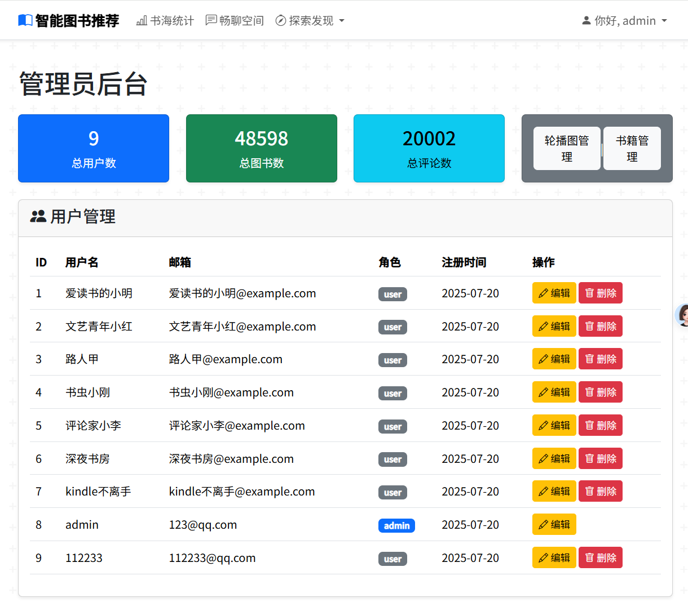
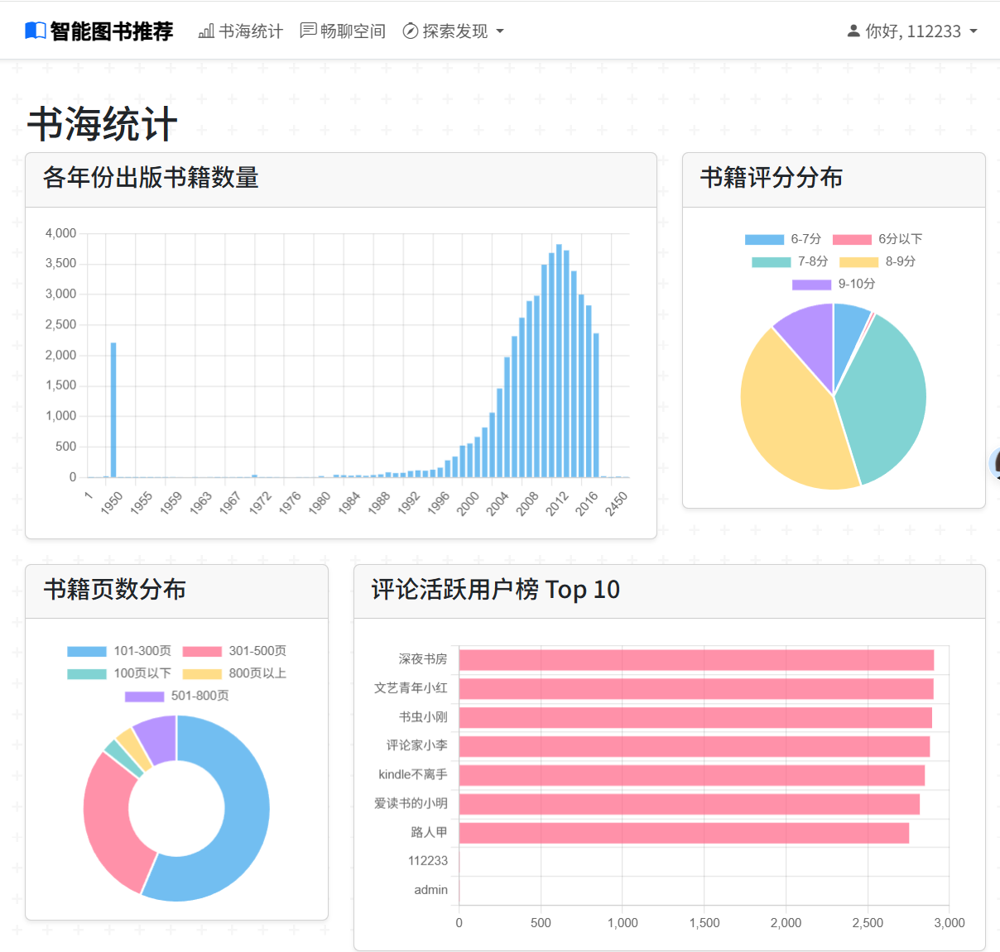
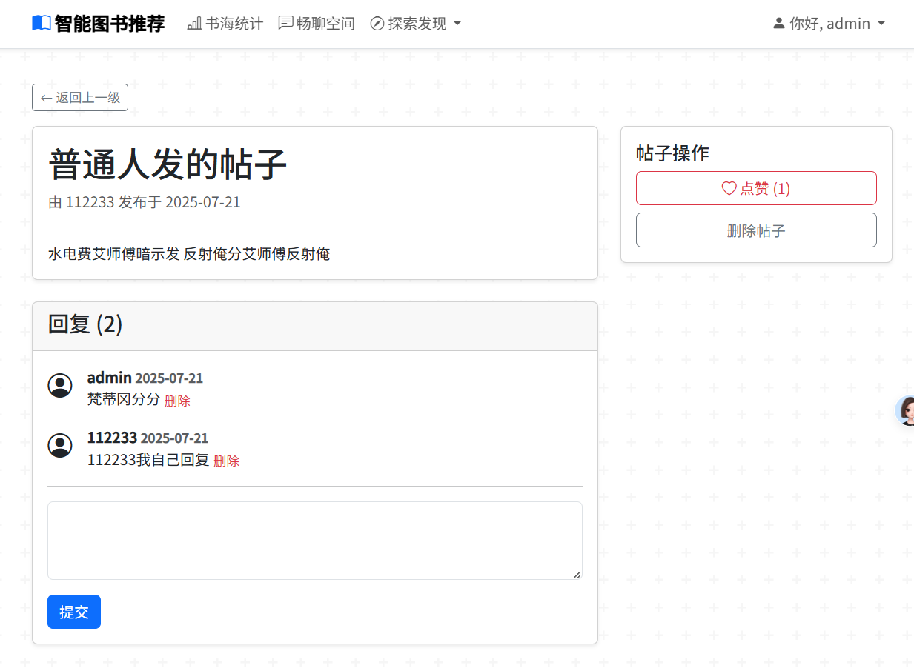

# 智能图书推荐系统 (Intelligent Book Recommendation System)

这是一个基于情感分析的智能图书推荐系统。系统使用Flask框架构建，融合了内容推荐算法与情感分析权重，旨在为用户提供个性化、高质量的图书发现体验。

## ✨ 项目截图

<p align="center">
  
</p>


## 🚀 主要功能

- **用户系统**: 支持用户注册、登录、信息修改和管理员后台管理。
- **图书浏览与搜索**: 用户可以浏览、搜索全站数万本图书，查看详情和简介。
- **社区互动**:
    - **畅聊空间**: 用户可以发布帖子，进行图书相关的交流。
    - **评论与情感分析**: 用户可以对书籍发表评论，系统会自动进行情感打分。
    - **点赞与收藏**: 支持用户点赞帖子和收藏喜爱的书籍。
- **智能推荐**: 在图书详情页，为用户提供基于“内容相似度+情感口碑”的加权智能推荐。
- **数据看板**: 以可视化的图表展示网站的书籍、用户等统计数据。
- **后台管理**: 管理员拥有专属后台，可以管理用户、书籍（支持Excel批量导入）、首页轮播图等。


**功能截图：**

（1）畅聊空间

<p align="center">
  
</p>

（2）后台管理

<p align="center">
  
</p>

（3）书海统计

<p align="center">
  
</p>

（4）畅聊空间/帖子详情

<p align="center">
  
</p>

## 

## 🛠️ 技术栈

- **后端**: Python, Flask, SQLAlchemy, Flask-Login
- **数据库**: MySQL
- **数据处理与算法**: Pandas, Scikit-learn, SnowNLP
- **前端**: HTML, CSS, JavaScript, Bootstrap 5, Chart.js
- **数据获取**: OpenLibrary API, Python (requests, deep-translator)

## 本地运行指南

**1. 克隆仓库**

```bash
git clone [https://github.com/LAKK-LAKK/book-recommendation-system.git](https://github.com/LAKK-LAKK/book-recommendation-system.git)
cd book-recommendation-system
```

**2. 创建并激活虚拟环境**
```bash
python -m venv venv
# Windows
venv\Scripts\activate
# macOS / Linux
source venv/bin/activate
```

**3. 安装依赖**
```bash
pip install -r requirements.txt
```

**4. 配置环境变量**
- 将 `.env.example` 文件复制为 `.env`。
- 修改 `.env` 文件，填入您自己的MySQL数据库连接信息和 `SECRET_KEY`。

**5. 初始化数据库**

- 在您的MySQL服务中，手动创建一个数据库（例如 `douban_book_recommendation`）。
- 导入“douban_book_recommendation.sql”，创建所有需要的表。

**6. （可选，这部分脚本可能需要更新）准备数据**

- 运行数据导入和处理脚本（如果需要初始数据）：
  ```bash
  python 1_import_books.py
  python 2_generate_comments.py
  python 6_populate_publication_dates.py
  # ... 其他数据处理脚本 ...
  ```

**7. （可选，如果更新了书籍信息，则需运行这个，保证推荐准确）运行预计算脚本**

```bash
python precompute_recs.py
```

**8. 启动应用**

```bash
flask run
# 或者
python run.py
```
应用将运行在 `http://127.0.0.1:5000`。

## 📝 许可证

本项目采用 [MIT License](LICENSE) 授权。